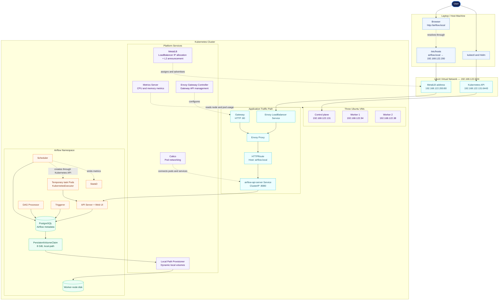

# Airflow Platform

A hands-on learning project for deploying and operating Apache Airflow on a
local multi-node Kubernetes cluster.

## Initial goals

- Learn Kubernetes through practical exercises.
- Deploy Airflow to the cluster.
- Understand the main Airflow and Kubernetes components.
- Document the setup and decisions as the project develops.

## Documentation

- [Initial Airflow deployment plan](docs/00_plan_v1.md)
- [Step 1: Configure access to the Kubernetes cluster](docs/01_kubernetes-cluster-access.md)
- [Step 2: Inspect the Kubernetes cluster](docs/02_cluster-inspection.md)
- [Step 3: Install Helm](docs/03_helm-installation.md)
- [Step 4: Align the kubectl client version](docs/04_kubectl-version-alignment.md)
- [Step 5: Configure and test persistent storage](docs/05_persistent-storage.md)
- [Step 6: Deploy and troubleshoot Airflow](docs/06_airflow-deployment-troubleshooting.md)
- [Operations quick reference](docs/07_operations-quick-reference.md)
- [Technical debt](docs/08_technical-debt.md)
- [Step 7: Install and configure Metrics Server](docs/09_metrics-server.md)
- [Step 8: Configure MetalLB](docs/10_metallb-load-balancer.md)
- [Step 9: Expose Airflow with Gateway API](docs/11_gateway-api-envoy.md)

## Platform architecture

## Status

Airflow is running on the Kubernetes cluster with `KubernetesExecutor`,
persistent PostgreSQL storage, and stable local UI access through MetalLB and
Envoy Gateway at [http://airflow.local](http://airflow.local).
